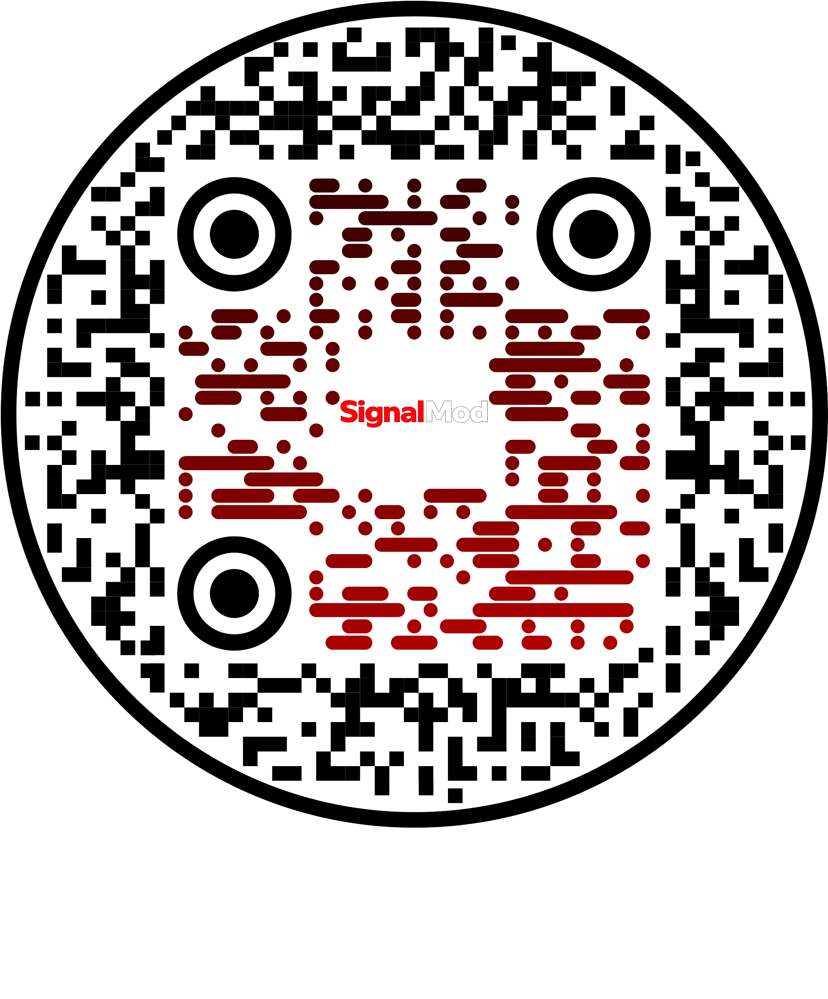

<div align="center">
<br />


<br />



### Intelligent moderation for YouTube comments

🌐 **English** · [Español](README.es.md)


</div>

---

## Project description

**SignalMod** is an intelligent moderation assistant for YouTube comments. It automatically classifies each comment as **Safe** or **Toxic**, returns a probability between 0 and 1, and tags toxicity categories (insult, threat, identity hate, obscene content).

It is built around the team's **hybrid meta-feature stacking** model — frozen Toxic-BERT embeddings combined with metadata features and a regularised logistic regression — reaching **F1 = 0.805** with a train–test gap of **2.54 pp** on the project's 200-sample test split.

The product ships as a FastAPI REST service plus a React SPA that mimics the YouTube Watch experience: pick a video, the API fetches the latest 50 comments via the YouTube Data API, scores them, and persists every prediction in Supabase so any visitor can see the full history.

---

## Tools and languages

### Languages
- **Python 3.12** — backend, ML pipelines, evaluation.
- **TypeScript + React 18** — frontend SPA.
- **SQL (PostgreSQL via Supabase)** — predictions persistence.

### Backend
- **FastAPI 0.136** — REST API, Pydantic schemas, lifespan model loading.
- **Uvicorn** — ASGI server with hot reload.
- **scikit-learn 1.8** — TF-IDF baseline + meta-learner Logistic Regression.
- **Optuna** — hyperparameter search for the TF-IDF baseline.
- **PyTorch 2.x + Transformers 5.9** — frozen `unitary/toxic-bert` for CLS embeddings.
- **spaCy + NLTK** — lemmatisation, stopwords, regex-based cleanup.
- **MLflow** — experiment tracking.
- **Supabase Python SDK** — predictions persistence with anonymous RLS policies.
- **google-api-python-client** — YouTube Data API v3 integration.

### Frontend
- **React 18 + Vite 5 + TypeScript** — SPA with hot module reload.
- **CSS modules** — YouTube-like dark theme.

### Tooling and ops
- **uv** — Python package and venv manager (`pyproject.toml` + `uv.lock`).
- **pnpm** — frontend package manager.
- **Docker + Docker Compose** — single-container deploy serving API + built SPA.
- **GNU Make** — `make dev`, `make install`, `make build`, `make docker`.
- **Render** — free-tier deploy via `render.yaml` blueprint.
- **Pytest** — unit tests for API contracts and preprocessing.

---

## Project architecture

```
Project_9_Equipo3/
├── configs/                       # YAML configs for pipelines and inference catalog
│   ├── pipeline.yaml              # Training data paths, target columns, CV folds
│   ├── features.yaml              # Preprocessing and TF-IDF settings
│   ├── model_catalog.yaml         # Inference catalog (3 swappable models)
│   ├── best_params.yaml           # Optuna winner for the LR baseline
│   ├── suggested_videos.yaml      # YouTube IDs shown in the Up-next rail
│   └── *_training.yaml            # Training profiles (golden baseline, expert, hybrid, …)
├── data/                          # Raw and processed datasets (git-ignored)
├── docs/                          # API.md, PIPELINE.md, ARCHITECTURE.md, DEPLOY.md
│   └── assets/signalmod_logo.png  # Brand assets
├── frontend/                      # React + Vite SPA
│   ├── public/signalmod_logo.png  # Logo served as static asset
│   └── src/
│       ├── api/                   # Typed HTTP client
│       ├── components/            # Layout, CommentRow, SuggestedRail, ModelBanner
│       ├── context/               # Global app state (active model, threshold)
│       ├── hooks/                 # useDebouncedPredict
│       ├── pages/                 # WatchPage, HubPage, SettingsPage
│       └── utils/                 # toxicityColor, randomUsername, relativeTime
├── models/
│   ├── baseline/lr_tfidf.joblib   # Optuna-tuned LR baseline
│   └── production_final/          # meta_stack_final.joblib — production artifact
├── notebooks/
│   ├── 01–04                      # EDA, preprocessing, TF-IDF, baseline LR
│   ├── 12                         # Golden baseline (frozen Toxic-BERT)
│   ├── 14                         # Final meta-stacking — production artifact
│   └── archive_attempts/          # Earlier experiments preserved for reproducibility
├── reports/                       # Metrics, plots, EDA figures, summary.csv
├── src/
│   ├── api/                       # FastAPI app
│   │   ├── main.py                # Lifespan, CORS, static SPA mount
│   │   ├── routes/                # health, models, predict (+ /predictions), videos
│   │   ├── schemas.py             # Pydantic request/response models
│   │   ├── services.py            # predict_single, to_predict_response
│   │   ├── state.py               # Shared app state
│   │   └── youtube.py             # YouTube Data API fetch + suggested metadata
│   ├── data/                      # Loader, dual loader for hybrid pipelines
│   ├── db/                        # Supabase client + save_prediction helpers
│   ├── evaluation/                # Evaluator, threshold tuning, stable CV
│   ├── experiments/               # Notebook 13 / 14 script versions
│   ├── features/                  # text_preprocessor, vectorizer, metadata, augmentation
│   ├── models/                    # baseline (LR/RF/XGBoost), hybrid_ensemble, metadata_lr
│   ├── pipeline/                  # run_pipeline + per-strategy variants
│   ├── service/                   # ModelService, meta_stack_predictor, model_catalog
│   └── utils/                     # Logger
├── supabase/predictions_setup.sql # SQL to create the predictions table + RLS policies
├── tests/                         # Pytest suite
├── Dockerfile                     # Multi-stage build (frontend + uv backend)
├── docker-compose.yml             # One-container deploy serving API + SPA
├── render.yaml                    # Render blueprint (web service + static site)
├── Procfile                       # Render process declaration
├── Makefile                       # make dev / install / build / docker / test
├── pyproject.toml + uv.lock       # Python dependencies pinned with uv
└── README.md  /  README.es.md     # English / Spanish documentation
```

### Data flow

```
                ┌────────────────────────────────────────────────┐
                │  React SPA (Vite)         http://localhost:5173│
                │  Layout · Watch · Hub · Settings               │
                └──────────────────┬─────────────────────────────┘
                                   │ HTTP JSON  (Vite proxy → :8000)
                ┌──────────────────▼─────────────────────────────┐
                │  FastAPI                  http://localhost:8000│
                │  /predict  /predict-batch  /predict-video      │
                │  /predictions (GET — Supabase history)         │
                │  /models  /models/select  /model-info          │
                │  /videos/suggested  /health                    │
                └──────┬─────────────────────────────┬───────────┘
                       │                             │
        ┌──────────────▼─────────────┐ ┌─────────────▼──────────────┐
        │  ModelService              │ │  YouTube Data API v3       │
        │  · local joblib            │ │  · video metadata          │
        │  · hf_remote               │ │  · 50 newest comments      │
        │  · meta_stack (production) │ │                            │
        └──────┬─────────────────────┘ └────────────────────────────┘
               │
        ┌──────▼──────────────────────────────────────────────────┐
        │  Supabase (PostgreSQL)                                  │
        │  table: predictions(id, created_at, text, video_id,     │
        │                     probability, is_toxic, labels, …)   │
        │  RLS: anon insert + anon select                         │
        └─────────────────────────────────────────────────────────┘
```

### Model catalog (swappable from the UI)

| Model                            | Type        | F1 (test) | Train–test gap | Threshold | Latency | Default |
| -------------------------------- | ----------- | --------- | -------------- | --------- | ------- | ------- |
| **Meta-Feature Stacking**        | Hybrid      | **0.805** | **2.54 pp**    | **0.381** | ~400 ms | **Yes** |
| Frozen Toxic-BERT                | Transformer | 0.790     | 0.16 pp        | 0.120     | ~400 ms | No      |
| LR + TF-IDF (Optuna)             | sklearn     | 0.758     | 4.76 pp        | 0.500     | < 50 ms | No      |

The production model concatenates the frozen `[CLS]` embedding from `unitary/toxic-bert` (768-d) with hand-crafted metadata features (length, uppercase ratio, emoji density…), scales them with `StandardScaler`, and feeds them into a `LogisticRegression(C=0.001)` meta-learner.

---

## Setup & run

### 1. Prerequisites

| Tool        | macOS / Linux                       | Windows                                                   |
| ----------- | ----------------------------------- | --------------------------------------------------------- |
| **Python 3.12** | `brew install python@3.12`      | [python.org/downloads](https://www.python.org/downloads/) (check *Add Python to PATH*) |
| **uv**      | `curl -LsSf https://astral.sh/uv/install.sh \| sh` | `powershell -c "irm https://astral.sh/uv/install.ps1 \| iex"` |
| **Node.js 18+** | `brew install node`             | [nodejs.org](https://nodejs.org/) (LTS)                  |
| **pnpm**    | `npm i -g pnpm`                     | `npm i -g pnpm`                                           |
| **Make** *(optional)* | already installed         | `winget install GnuWin32.Make`  (or use WSL)              |

### 2. Clone & configure

```bash
git clone https://github.com/Bootcamp-IA-P6/Project_9_Equipo3.git
cd Project_9_Equipo3

cp .env.example .env
# Fill: YOUTUBE_API_KEY, SUPABASE_URL, SUPABASE_KEY
```

> **Windows PowerShell**: replace `cp` with `Copy-Item .env.example .env`.

Paste `supabase/predictions_setup.sql` into the Supabase SQL editor before the first run (creates the `predictions` table + RLS policies).

### 3. Run — three ways

#### Option A — With Makefile (recommended on macOS / Linux / WSL)

```bash
make install     # uv sync  +  pnpm install
make dev         # FastAPI :8000  +  Vite :5173
```

| Command       | What it does                                  |
| ------------- | --------------------------------------------- |
| `make install`| Install Python + frontend deps                |
| `make dev`    | Start API and UI in parallel (Ctrl+C stops both) |
| `make api`    | API only                                      |
| `make ui`     | UI only                                       |
| `make build`  | Build the SPA into `frontend/dist`            |
| `make test`   | Run Pytest                                    |
| `make docker` | `docker compose up --build`                   |
| `make stop`   | Kill anything on ports 8000 / 5173            |
| `make clean`  | Remove `.venv`, `node_modules`, `dist`        |

#### Option B — Manual (macOS / Linux)

Two terminals.

**Terminal 1 — API**
```bash
uv sync
uv run uvicorn src.api.main:app --reload --port 8000
```

**Terminal 2 — Frontend**
```bash
cd frontend
pnpm install
pnpm dev
```

#### Option C — Manual (Windows PowerShell)

Two terminals.

**Terminal 1 — API**
```powershell
uv sync
uv run uvicorn src.api.main:app --reload --port 8000
```

**Terminal 2 — Frontend**
```powershell
cd frontend
pnpm install
pnpm dev
```

> If `uv` is not recognised after install, close and reopen PowerShell so the new `PATH` is picked up.

### 4. Open the app

| URL                            | What you'll see                          |
| ------------------------------ | ---------------------------------------- |
| http://localhost:5173          | React SPA — Watch / Hub / Settings       |
| http://localhost:8000/docs     | FastAPI Swagger UI                       |
| http://localhost:8000/health   | Health check                             |

### 5. Docker (one container — API + SPA built)

Same commands on **macOS / Linux / Windows**:

```bash
# Normal — keeps images and volumes for fast rebuilds
docker compose up --build
# → http://localhost:8000  ·  Ctrl+C to stop  ·  docker compose down

# Ephemeral demo — Ctrl+C tears down container + image + volumes
make docker-demo

# Manual full cleanup
make docker-clean
# (equivalent to: docker compose down --rmi local --volumes --remove-orphans)
```

---

More: see [docs/PIPELINE.md](docs/PIPELINE.md) for training, [docs/API.md](docs/API.md) for endpoints, [docs/DEPLOY.md](docs/DEPLOY.md) for Render deployment.

---

## Contributors

<table>
  <tr>
    <td align="center" width="25%">
      <b>Andrés Torrez</b><br/>
      <sub>Backend Developer</sub>
    </td>
    <td align="center" width="25%">
      <b>Mirae Kang</b><br/>
      <sub>Scrum Master</sub>
    </td>
    <td align="center" width="25%">
      <b>Jonathan Brasales</b><br/>
      <sub>AI Developer</sub>
    </td>
    <td align="center" width="25%">
      <b>Roberto Molero</b><br/>
      <sub>Product Owner</sub>
    </td>
  </tr>
</table>
