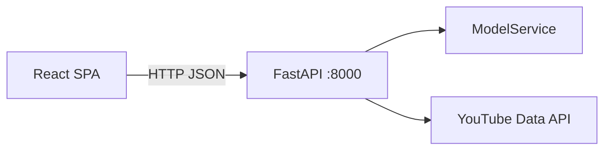

# Arquitectura del sistema

## Runtime (producción)

- **UI:** `frontend/` → `frontend/dist`, servido por FastAPI.
- **Inferencia:** `ModelService` en `src/service/`.
- **Catálogo:** `configs/model_catalog.yaml` — baselines + producción.

## Desarrollo local

| Proceso | Comando | Puerto |
|---------|---------|--------|
| API | `uv run uvicorn src.api.main:app --reload` | 8000 |
| UI | `cd frontend && npm run dev` | 5173 |

## Docker

Un servicio en el puerto **8000** (API + UI estática).

## Etiquetas

- `IsToxic` → Seguro (0) / Tóxico (1)
- API: `is_toxic`, `probability`, `model_used`
