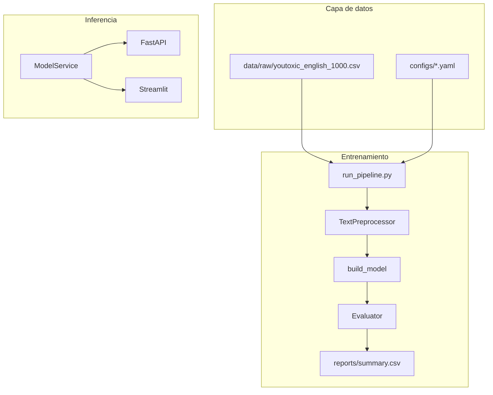

# Arquitectura del sistema

## Componentes

## Módulos

| Módulo | Función |
|--------|---------|
| `src/data/loader.py` | Carga del dataset |
| `src/features/text_preprocessor.py` | Limpieza y lematización |
| `src/models/baseline.py` | Modelos sklearn + TF-IDF |
| `src/evaluation/evaluator.py` | Métricas y comparativa |
| `src/pipeline/run_pipeline.py` | Pipeline completo |
| `src/service/model_service.py` | Predicción unificada |
| `src/api/main.py` | API REST |
| `src/app/app.py` | Interfaz Streamlit |

## Etiquetas

- Binario: `IsToxic` → Seguro (0) / Tóxico (1)
- API: `is_toxic`, `probability`

## Docker

Dos servicios: API (8000) y Streamlit (8501), imagen `youtube_hate_detector:latest`.
