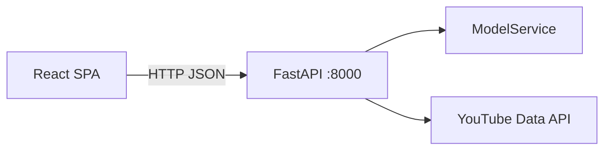

# Architecture — youtube_hate_detector

## Runtime (production)



- **UI:** `frontend/` built to `frontend/dist`, served by FastAPI `StaticFiles` in production.
- **Inference:** Only `ModelService` in `src/service/` loads models.
- **Catalog:** `configs/model_catalog.yaml` — add models without React changes.
- **Suggested videos:** `configs/suggested_videos.yaml` — YouTube video IDs for the right rail.

## Local development

| Process | Command | Port |
|---------|---------|------|
| API | `uv run uvicorn src.api.main:app --reload` | 8000 |
| UI | `cd frontend && npm run dev` | 5173 (proxies API) |

## Docker

Single service `youtube_hate_detector-app` on port **8000** (API + static UI).

## API layout

```
src/api/
  main.py           # app factory, CORS, static mount
  schemas.py        # Pydantic models
  services.py       # predict helpers
  youtube.py        # comment fetch + metadata
  state.py          # shared app state
  routes/
    health.py
    models.py
    predict.py
    videos.py
```
