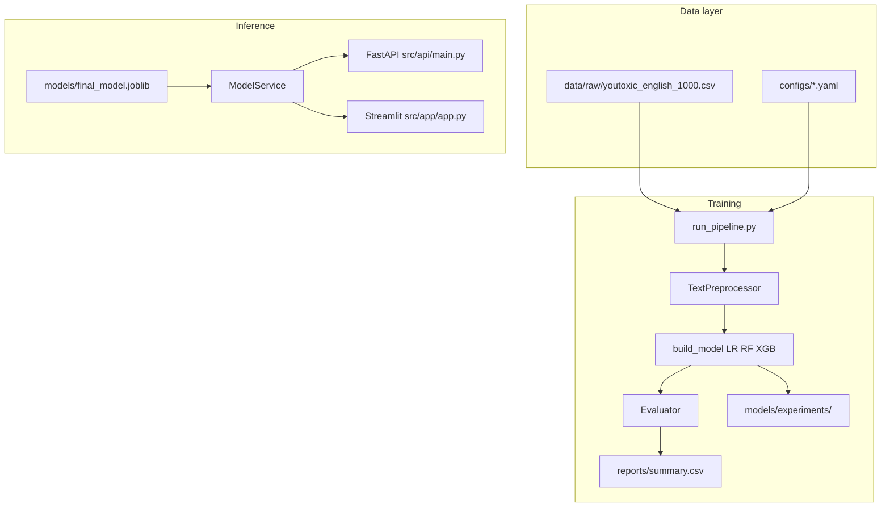

# System architecture

## Components

## Module map

| Module | Responsibility |
|--------|----------------|
| `src/data/loader.py` | Load raw CSV, optional processed paths |
| `src/features/text_preprocessor.py` | Clean and lemmatize text |
| `src/features/vectorizer.py` | Standalone TF-IDF (notebooks); baselines embed TF-IDF in sklearn `Pipeline` |
| `src/models/baseline.py` | `LRModel`, `RFModel`, `XGBModel`, `build_model()` |
| `src/evaluation/evaluator.py` | Metrics, ROC, confusion matrix, error analysis, `summary.csv` |
| `src/pipeline/run_pipeline.py` | Orchestrates training + evaluation |
| `src/service/model_service.py` | Loads joblib or Hugging Face models; `predict(text)` |
| `src/api/main.py` | REST endpoints, lifespan model load |
| `src/app/app.py` | Streamlit UI; calls `ModelService` directly |

## Label strategy

- **Binary default:** column `IsToxic` → Safe `0`, Toxic `1`
- User-facing strings: **Safe** / **Toxic** (not “hate” or “harmful” in the UI copy)
- API returns `is_toxic` and `probability` (P(toxic))

## Docker

[`docker-compose.yml`](../docker-compose.yml) runs two containers from one image:

- `youtube_hate_detector-api` — uvicorn port 8000
- `youtube_hate_detector-streamlit` — port 8501

Both include `final_model.joblib`, configs, spaCy, and NLTK data baked into the image.

## Tests

[`tests/`](../tests/) — preprocessor, vectorizer, model binary outputs, `/predict` schema (mocked service).
